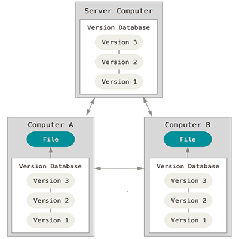
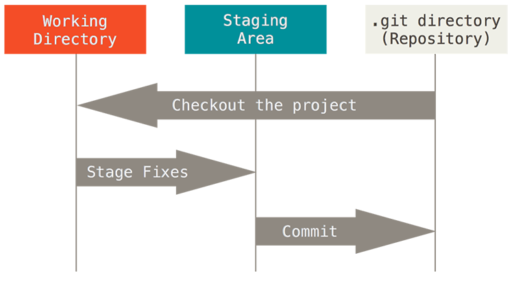
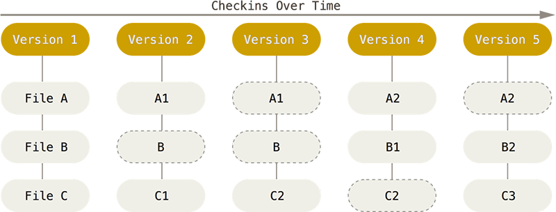
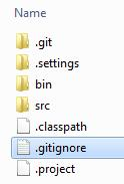

# Quick Introduction to Version control & Git (cli)

## Contents

- Why version control?
- Basic principles of Version Control System
- Git on command line
- Basic usage & workflow
- Remote hosting services: Github, Bitbucket, Gitlab
- Links to Learning materials
- Exercises

---

## Why to use VCS

_(Version Control System, revision control)_

- Compulsory tool for professional software development
- Track code changes
- What is changed since last version and before?
  - Why, comments
  - When did that happen?
  - Who did that?
- Share project code (and development history) —> Collaborate
- Backup??

- Example: [check revisions][wiki1] of an [Wikipedia article][wiki2]

[wiki1]: https://en.wikipedia.org/w/index.php?title=Git_(software)&action=history
[wiki2]: https://en.wikipedia.org/wiki/Git_(software)

---

## Basic concepts

- **Repository**: storage for all files and their revision data
- **Clone**: taking a full copy of an existing repository
- **Commit**: saving a new revision of code and naming it (= adding a message/description)
- **Checkout**: choosing specified version of code or development branch to work with
- **Branches**: parallel development versions of code
- **Tag**: special label for a revision (e.g. Release v. 1.1)
- **Merge**: combining changes of different branches together
- **Conflict**: occurs when there is different modifications in the same file while trying to merge branches

---

## Git

- Development started By Linus Torvalds 2005
- Created for Linux kernel development
- Distributed System
- Can be used locally
-> remote server not mandatory

---

## Git installation

- Command line user interface running in operating system's terminal is the original/default tool
  - Windows: [Git for windows](https://gitforwindows.org/) provides command line tools (git bash) and Graphic UI tools/integration to Windows explorer
  - MacOS: [Several options](https://git-scm.com/download/mac)
  - Linux/Unix: via package manager, e.g. `apt install git` or `yum install git`
- Multiple [graphical UIs](https://git-scm.com/downloads/guis) are available too  
- Integrated Git support or a plugin is provided for most/all popular IDEs

---

## Git basic usage & commands

- `git clone <URI>`: clone an existing repository (creates a local copy of the repo)
- `git init`: create a new git repository
- `git add [filenames]`: choose files for the next commit (add to staging area)
- `git commit`: save a version of chosen files (needs a message too, e.g. `-m "added new file"`)
- `git status`: check current status of the repo
- `git log`: show revision history
- `git branch <newBranchName>`: create a new branch based on the current branch
- `git checkout <branchName>`: choose a branch or a revision to work with
- `git push`: push the repository (new commits) to chosen remote repository
- `git pull`: pull the repository ( get new changes and commits) from remote repo
- `git diff`: shows the differences in files between working copy and the last commit

---

## Git Workflow

[Source](http://git-scm.com/book/en/v2/Getting-Started-Git-Basics)

---

## Git Revisions

- Git stores snapshots of all edited files in commits

[Source](http://git-scm.com/book/en/v2/Getting-Started-Git-Basics)

---

## Git ignore

Which files and changes should be tracked with version control? 
 
For example in following Eclipse Java project

only `src/` folder contains code files created by developers and everything else is generated automatically by Eclipse IDE (Integrated Development Environment) **->** `.gitignore` file for the project should be something like:

    bin/
    .settings/
    .project
    .classpath

`.git/` folder (contains the revision history etc.) and `.gitignore` file itself should be included in version control.

### Stuff to include

- all source code
- README.md and other documentation 
- license
- package.json and other settings files
- .gitignore file: list of local files not to be included in the version control ->
       
### Stuff to exclude

- IDE specific project files & folders (.idea)
- build targets and other automatically generated files
- packages managed e.g. by npm (= _node_modules_ folder) 
- any temp & OS specific files, like Apple's `.DS_Store` 

### Examples

A collection of useful _.gitignore_ templates for different kind projects [in GitHub](https://github.com/github/gitignore).

---

## [GitHub](https://github.com)

- **GitHub != Git** (Git is the application, GitHub is a company/service utilizing Git.)
- Commercial service providing a remote git repository server, project management tools, wiki, issue tracker, webpage hosting, etc.
- has a wide user community
- **Fork**: Create a new Github project, clone the git repository of an existing project and add repo to the new project
- Almost _de facto_ hosting service for Open Source projects
- Repositories (projects) are public by default, private repos are accessible only for invited collaborators 

- [Bitbucket](https://bitbucket.org) is another popular git repo hosting service providing free private repos for small teams
- [GitLab](https://about.gitlab.com/install/) provides a commercial service or free open source community edition to installed on one's own server

---

## Learn Git

Take a look at:

- Free book: [Pro Git](http://git-scm.com/book/en/v2)
- Basics at Codecademy: [Learn Git](https://www.codecademy.com/learn/learn-git)
- [GitHub Guides](https://guides.github.com/)
- [Atlassian Git Tutorials](https://www.atlassian.com/git/tutorials/)

---

## Exercises

### Exercise 0: Learn Git online course

Optional but highly recommended short (15+ mins) online course at: https://www.codecademy.com/learn/learn-git

(You need to create a free account to access the course)

---

### Exercise 1: Git command line basics

1. Install Git if missing command line tools. [Instructions](https://git-scm.com/book/en/v2/Getting-Started-Installing-Git), [tips for basic git config](https://gist.github.com/mattpe/2f26d86ee1ba9088e19a)
2. Create a local repo by **cloning** (`git clone`) this lecture material from Github: <https://github.com/mattpe/git-intro.git>
3. Create a remote repository at Github
4. Change the remote _origin_ to point to your Github repo (tip: `git remote help`)
  - remove existing _origin_
  - add new _origin_: url to your Github repo
5. Push the files to your Github repo
6. Create a file `notes.md` in your local repo and record all git commands you have used into that file (check command: `history`)
7. Add the file to the local git repo
8. Commit your changes (remember to write a comment)
9. Push changes to remote repo
10. Update the file by adding new commands to list and _add, commit & push_ changes again

---

### Exercise 2: Collaboration & conflicts

1. Form a team of ~3 members
2. Choose a Github repo (from ex. 1) of one of the team members and add write/push permissions to other members of the team (add collaborators in Github, every team member should be able to push to that repo)
3. all team members should clone the same remote repo
4. do individually at the same time as your team mates:
  - pull changes from remote repo (not needed if repo was cloned just before)
  - create and checkout a new development branch for your modifications  
  - edit files locally (e.g. add, remove & modify rows)
  - add & commit changes
  - merge your development branch to `master` branch
  - try pushing `master` to remote repo
  - resolve conflicts when needed, ([help](https://help.github.com/articles/resolving-a-merge-conflict-from-the-command-line/)), commit and push
5. Go back to 4 (once at least)

---

### Returning exercises

Check related assignment in Oma for instructions.
